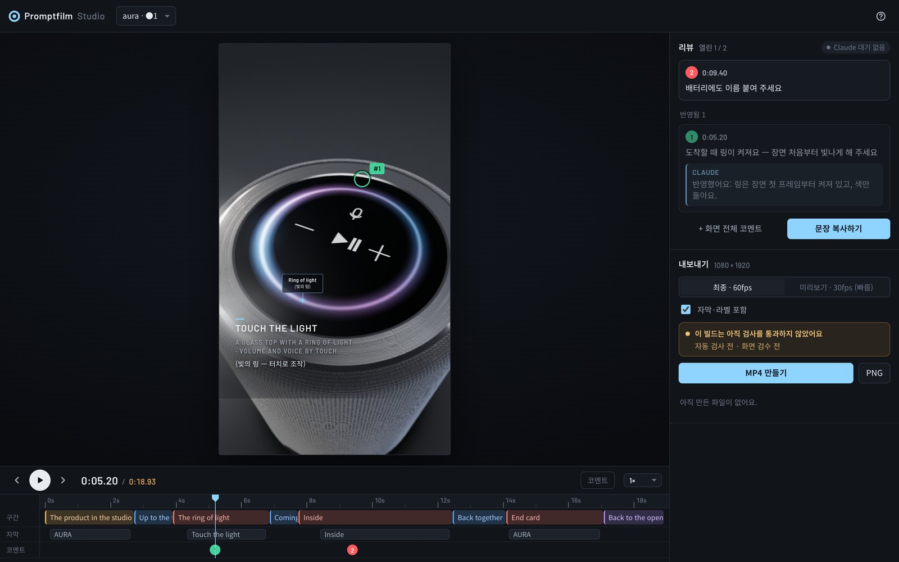

<div align="center">

# Promptfilm

**한 문장이면, 리서치까지 마친 3D 모션그래픽이 나와요.**

[Claude Code](https://claude.com/claude-code)용 스킬이에요. 요청 한 문장을 실시간 3D 영상으로 만들어 줘요.<br>
결과물은 HTML 파일 하나예요. 끊김 없이 반복 재생되고, 프레임 하나 어긋나지 않게 MP4로 뽑을 수 있어요.

[](LICENSE)
[](#설치)
[](#필요한-것)

[English](README.md) · 한국어


<sub><i>"블랙웰 그래픽카드 본체부터 원자 단위까지 확대해 줘" — 이 스킬의 기준이 된 영상 한 바퀴를 약 2.5배속으로 재생한 모습</i></sub>

</div>

## 빠른 시작

Claude Code에서:

```
/plugin marketplace add Seokwoooo/promptfilm
/plugin install promptfilm@promptfilm
```

Claude Code를 다시 시작하거나 `/reload-plugins`를 실행하세요. 직접 설치할 건 [Node.js](https://nodejs.org) 20 이상뿐이에요. 나머지는
첫 실행 때 알아서 확인하고, 없으면 설치해요(자세한 내용은 [필요한 것](#필요한-것)에 있어요).

그다음엔 `/promptfilm` 뒤에 원하는 걸 한 줄로 적으면 돼요.

**스케일 여행**

```
/promptfilm 지구부터 관측 가능한 우주까지 확대하는 영상 만들어줘
```

**작동 원리**

```
/promptfilm 기계식 시계가 어떻게 가는지 태엽부터 바늘까지 보여줘
```

**제품 광고**

```
/promptfilm 에어팟 프로 3 광고 느낌의 제품 영상 만들어줘
```

## 특징

- **슬라이드가 아닌 진짜 영상**: HTML 파일 하나 안에서 Three.js로 실시간 렌더링해요. 스튜디오 조명과 실제 같은 재질을 쓰고,
  컷 없이 카메라 한 대로 이어서 찍은 것처럼 움직여요. 끝이 처음과 자연스럽게 이어져서 계속 반복돼요.
- **짐작 대신 리서치**: 웹에서 사실과 사진, 영상을 직접 찾아요. 화면에 나오는 숫자는 전부 출처가 있고, 공개되지 않은 부분은
  설명용이라고 밝혀 둬요.
- **읽을 틈을 주는 속도**: 자막이 가리키는 대상 앞에서 카메라가 멈추고, 자막을 다 읽을 때까지 기다렸다가 부드럽게 넘어가요.
- **주제도 형식도 자유롭게**: 스케일 여행, 제품 광고, 앱·게임 데모, 작동 원리 설명, 유명한 장면 재현, 로고 인트로, 데이터
  시각화까지 만들 수 있어요. 쇼츠·릴스·틱톡용 9:16이 기본이고, 16:9, 1:1, 4:5도 돼요. 자막은 한 언어나 두 언어로 넣어요.
- **검사를 통과해야 완성**: 자동 검사를 돌리고, 제작에 참여하지 않은 에이전트가 화면을 따로 검수하고, 마지막 납품 판정까지
  통과해야 끝나요.
- **검토용 Studio**: 영상을 앞뒤로 넘겨 보고, 화면에 코멘트를 달고, 구간 속도를 바꾸고, MP4로 내보내요.

<div align="center">

<br><sub><i>엔진 테스트용 9:16 제품 영상(가상의 스피커)</i></sub>
</div>

## 작동 방식

| | 단계 | 하는 일 |
|---|---|---|
| 1 | **질문** | 리서치 깊이, 화면 비율, 영상 길이, 자막 언어를 한 번에 물어요. 그다음부터는 알아서 진행해요. |
| 2 | **리서치** | 출처가 있는 사실과 참고 사진, 참고 영상의 장면을 모아요. |
| 3 | **스토리보드** | 장면 카드를 시간에 맞춰 짜서 Studio에 띄우고, 승인을 기다려요. |
| 4 | **제작** | 스킬에 들어 있는 엔진으로 영상을 만들어요. |
| 5 | **검사** | 자동 검사, 제3자 화면 검수, 납품 판정을 거쳐요. READY가 나올 때까지 고치고 다시 확인해요. |
| 6 | **납품** | HTML 파일을 넘기고(버전별로 모두 보관), 원하면 1080p 60fps MP4도 만들어요. |

> [!NOTE]
> 영상 하나 만드는 데 **몇 시간**이 걸리고 토큰도 많이 들어요. 리서치하고, 만들고, 여러 번 검사하기 때문이에요.

## Studio



영상을 만드는 동안 저절로 열리는 로컬 페이지예요.

- **재생하고 넘겨 보기**: 구간·자막·코멘트가 표시된 타임라인에서 원하는 곳으로 바로 이동해요.
- **화면에 코멘트**: 이상한 곳을 클릭해서 적으면 Claude가 스냅샷과 함께 받아서 고치고, 답을 달아요.
- **구간 속도 조절**: 바꾼 속도는 영상을 다시 만들어도 그대로 남아요.
- **스토리보드 승인**: 만들기 전에 장면 구성을 확인해요.
- **내보내기**: MP4나 PNG 스틸로 내보내요. 검사를 통과하지 못한 빌드는 따로 표시돼요.

Studio는 내 컴퓨터(`127.0.0.1`)에서만 열려서, 밖에서는 접근할 수 없어요.

## 필요한 것

| 무엇 | 준비 방법 |
|---|---|
| **Claude Code** | 권장: Claude Opus 5.5, Sonnet 5.5, Fable 5.1(또는 그보다 새 버전), effort medium 이상. 다른 환경에서도 돌아가지만, 품질을 보장할 수 없다고 처음에 한 번 알려 줘요. |
| **Node.js 20 이상** | [nodejs.org](https://nodejs.org)에서 직접 설치하세요. 없는데 Homebrew가 있으면 첫 실행 때 알아서 설치해요. |
| **스크립트 패키지** | 플러그인을 설치할 때, 또는 첫 실행 때 자동으로 깔려요 |
| **헤드리스 Chrome** | 쓰던 Chrome이 헤드리스로 돌면 그대로 쓰고, 아니면 첫 실행 때 Playwright의 Chromium을 받아요(약 150MB) |
| **ffmpeg** | PATH에 있으면 그걸 쓰고, 없으면 첫 실행 때 스킬 전용 ffmpeg를 받아요(약 45MB) |
| **yt-dlp** *(선택)* | 참고 영상에서 장면을 뽑을 때만 필요해요. `brew install yt-dlp` 또는 `pipx install yt-dlp` |

첫 실행 때의 설치는 관리자 권한이 필요 없고, 기존에 깔린 건 아무것도 지우지 않아요. 그다음부터는 확인이 1초쯤이면 끝나요.
GPU가 있으면 좋아요. 없어도 돌아가지만, Chrome이 소프트웨어 렌더링으로 그려서 느려요. macOS(Apple Silicon)에서 개발하고
검증했어요. Linux에서도 될 거예요. Windows에서는 확인하지 못해서 WSL을 권해요.

**메모리**: 8GB면 충분해요. 영상을 검사할 때는 헤드리스 브라우저 하나만 띄워요(약 1.4GB, 데이터가 많은 영상은
2.6GB). MP4를 내보낼 때는 메모리의 절반에 들어가는 만큼만, 최대 네 개까지 띄워요. 8GB 맥에서는 대부분의 영상에 두
개(인코더까지 약 3.5GB), 데이터가 많은 영상에는 한 개를 쓰고, 16GB M2 Pro에서는 네 개(약 5GB)를 써요.
8GB라면 내보내는 동안 다른 무거운 앱은 닫아 두는 게 좋아요.

## 설치

### 플러그인으로 설치 (권장)

```
/plugin marketplace add Seokwoooo/promptfilm
/plugin install promptfilm@promptfilm
```

스크립트에 필요한 패키지는 Claude Code가 알아서 깔아 줘요. `/promptfilm`으로 시작하면 되고(정식 이름은 `/promptfilm:promptfilm`),
모션그래픽을 만들어 달라고만 해도 저절로 시작돼요.

**업데이트.** promptfilm은 Claude Code가 플러그인을 업데이트하는 방식 그대로, Claude Code 자체 자동 업데이트로 업데이트돼요.
새 버전이 처음 나왔을 때 Claude가 자동 업데이트를 켤지 한 번만 물어봐요. `/plugin` → **Marketplaces** → promptfilm →
**Enable auto-update**와 같은 스위치예요. 켜면 Claude Code가 알아서 최신 버전을 유지하고(영상을 시작할 때 새 버전이 있으면 바로
받아요), 끄면 직접 업데이트하기 전까지 그대로예요. 언제든 `/plugin`에서 바꾸거나 Claude에게 말하면 돼요. 확인 자체를 끄려면
`PROMPTFILM_NO_UPDATE=1`을 설정하세요. 2026년 10월 2일 이전에 설치한 버전은 아직 확인 기능이 없으니, 셸에서 한 번만 이렇게
업데이트해 주세요.

```sh
claude plugin marketplace update promptfilm && claude plugin update promptfilm@promptfilm
```

### 개인 스킬로 직접 복사

```sh
git clone https://github.com/Seokwoooo/promptfilm.git
cp -R promptfilm/skills/promptfilm ~/.claude/skills/
```

이렇게 설치하면 스킬 이름은 `/promptfilm`이고, 필요한 패키지는 첫 실행 때 깔려요.

### 설치 확인

Claude Code에 "promptfilm 셀프테스트 돌려줘"라고 하세요. 5분쯤 걸려요. 임시 폴더에 엔진 테스트 영상을 만들어 모든 검사를
돌리고, 일부러 심어 둔 결함을 검사가 잡아내는지도 확인해요.

## 사용법

`/promptfilm` 뒤에 평소 쓰는 말로, 어떤 언어로든 적으면 돼요.

```
/promptfilm 제트엔진이 어떻게 작동하는지 16:9 가로 30초로, 한국어 자막만 넣어서 만들어줘
/promptfilm 우리 앱 광고 느낌의 제품 영상 9:16으로 만들어줘
/promptfilm Zoom from a grain of sand out to the whole Sahara
```

같은 세션에서는 "스튜디오 열어줘", "리뷰 반영해줘", "mp4로 뽑아줘"처럼 평소 말로 이어서 요청하면 돼요.

영상은 작업 폴더 안에 영상마다 폴더 하나씩(`./<영상 이름>/`) 만들어져요. 첫 질문에서 고른 답은 `./.promptfilm/settings.json`에
저장돼서, 다음번에 기본값으로 먼저 나와요.

## 내 취향으로 바꾸기

기본 취향은 [`skills/promptfilm/taste.md`](skills/promptfilm/taste.md)에 있어요. 일반 시청자를 위한 쇼츠를 만드는 크리에이터의
취향이에요.

- 아무것도 갑자기 튀어나오지 않기
- 실제처럼 보이는 대상
- 모든 단계를 가까이에서 보여 주기
- 부드러운 카메라
- 지루한 구간 없애기

이 파일을 `./.promptfilm/taste.md`(이 프로젝트만)나 `~/.promptfilm/taste.md`(모든 프로젝트)로 복사해서 고치면 돼요. 형식
기본값, 속도, 색감과 조명, 보고 라벨, 절대 하면 안 되는 것까지 바꿀 수 있어요.

## 문제 해결

| 메시지 | 해결 |
|---|---|
| `SETUP MISSING node` | [nodejs.org](https://nodejs.org)에서 Node.js 20 이상을 설치한 뒤 `/promptfilm`을 다시 실행하세요 |
| `SETUP MISSING …` (그 밖의 것) | 무엇이 실패했는지와 해결 명령이 함께 나와요. 대개 네트워크 문제예요. 해결한 뒤 `/promptfilm`을 다시 실행하세요 |
| `Chrome not found`, `Cannot find package …` | 첫 실행 뒤에 뭔가 지워진 경우예요. `/promptfilm`을 다시 실행하면 알아서 다시 깔아요 |
| 내 도구를 쓰고 싶어요 | `CHROME=/path/to/chrome`이나 `FFMPEG=/path/to/ffmpeg`를 지정하세요 |
| 검사나 렌더링이 아주 느려요 | GPU 없이 소프트웨어 렌더링으로 그리는 중이에요. 느려도 결과는 같아요 |
| ⚠️ *권장 환경이 아니라서…* | 호스트, 모델, effort가 권장과 다를 때 한 번 나오는 안내예요. 스킬은 그대로 진행돼요 |

## 저장소 구성

```
.claude-plugin/          플러그인·마켓플레이스 매니페스트
skills/promptfilm/
├── SKILL.md             작업 순서
├── taste.md             기본 취향 프로필
├── references/          원칙, 속도, 레이아웃, 엔진 API, 기법, 검사, 검수, Studio
├── engine/              영상 엔진: 코어, 새 영상 템플릿, 테스트 영상 두 편
├── scripts/             설치 점검, 새 영상, 빌드, 검사, 시간 예산, 렌더, 검수, 판정, 셀프테스트
├── studio/              로컬 Studio
├── examples/            기준 영상 두 편의 코드 (템플릿이 아니라 구현 참고용)
└── evals/               테스트 요청과 기대 동작
```

## 라이선스

라이선스는 [MIT](LICENSE)예요. 외부 구성 요소, 이미지 출처, 상표는 [THIRD_PARTY_NOTICES.md](THIRD_PARTY_NOTICES.md)에 정리해
두었어요. Promptfilm은 개인 프로젝트로, Anthropic과 제휴하거나 Anthropic의 보증을 받지 않았어요.
