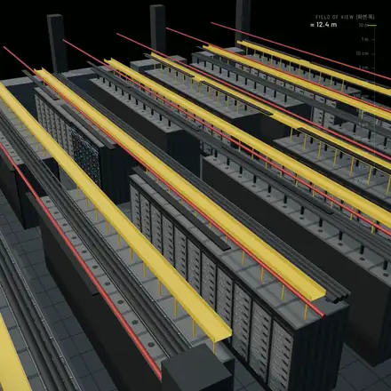

<div align="center">

# Promptfilm

**한 문장으로 요청하면, 리서치를 거친 3D 모션그래픽이 나옵니다.**

[Claude Code](https://claude.com/claude-code)에서 쓰는 스킬이에요. 요청 한 문장을 실시간 3D 영상으로 만들어 줍니다.<br>
HTML 파일 하나로 끝나고, 끊김 없이 반복 재생되며, 프레임 단위로 정확한 MP4로 뽑을 수 있어요.

[](LICENSE)
[](#설치)
[](#필요한-것)

[English](README.md) · 한국어



<sub><i>"블랙웰 그래픽카드 본체부터 원자 단위까지 확대해 줘" — 이 스킬의 기준이 된 두 영상 중 하나를 빠르게 돌린 모습</i></sub>

</div>

## 빠른 시작

Claude Code에서:

```
/plugin marketplace add Seokwoooo/promptfilm
/plugin install promptfilm@promptfilm
```

Claude Code를 다시 시작하거나 `/reload-plugins`를 실행한 뒤, 그냥 요청하면 돼요.

```
우주 스케일 영상, 지구부터 관측 가능한 우주까지 확대하는 영상 html 만들어줘
```

Node.js 20 이상, ffmpeg, Chrome도 필요해요. 자세한 건 [필요한 것](#필요한-것)을 보세요.

## 특징

- **슬라이드가 아니라 진짜 영상**: HTML 하나 안에서 Three.js로 실시간 렌더링해요. 스튜디오 조명과 물리 기반 재질을 쓰고, 카메라는
  끊기지 않고 이어지며, 끝과 처음이 자연스럽게 맞물려 반복돼요.
- **짐작 대신 리서치**: 웹에서 사실, 사진, 영상을 찾아요. 화면의 숫자에는 모두 출처가 있고, 공개되지 않은 부분은 설명용으로
  그렸다고 표시해요.
- **읽을 틈을 주는 속도**: 자막이 가리키는 대상마다 카메라가 도착해서, 다 읽을 때까지 멈췄다가, 부드럽게 넘어가요.
- **주제도 형식도 자유롭게**: 스케일 여행, 제품 광고, 앱·게임 데모, 원리 설명, 유명한 장면 재현, 로고 스팅, 데이터 스토리를 만들 수
  있어요. 쇼츠·릴스·틱톡용 9:16이 기본이고, 16:9, 1:1, 4:5도 돼요. 자막은 한두 개 언어로 넣어요.
- **확인을 거쳐야 완성**: 자동 검사, 영상을 만들지 않은 새 서브에이전트의 화면 검수, 납품 게이트를 모두 통과해야 해요.
- **검토용 Studio**: 영상을 넘겨 보고, 화면에 코멘트를 달고, 속도를 바꾸고, MP4로 내보내요.

<div align="center">

<br><sub><i>엔진 테스트용 9:16 제품 영상 (가상의 스피커)</i></sub>
</div>

## 작동 방식

| | 단계 | 하는 일 |
|---|---|---|
| 1 | **질문** | 리서치 깊이, 화면 비율, 한 바퀴 길이, 자막 언어를 한 번에 물어요. 그다음부터는 알아서 진행해요. |
| 2 | **리서치** | 출처가 있는 사실, 참고 사진, 참고 영상의 프레임을 모아요. |
| 3 | **스토리보드** | 시간 예산을 맞춘 장면 카드를 Studio에 띄우고 승인을 기다려요. |
| 4 | **빌드** | 함께 들어 있는 엔진 위에 영상을 작성해요. |
| 5 | **검사** | 자동 검사, 새 눈의 검수, 게이트를 거쳐요. READY가 나올 때까지 고치고 다시 확인해요. |
| 6 | **납품** | HTML(버전마다 보관)을 넘기고, 원하면 1080p 60fps MP4도 만들어요. |

> [!NOTE]
> 영상 하나에 **몇 시간** 정도 걸리고 토큰도 많이 써요. 리서치, 빌드, 여러 차례의 검사를 거치기 때문이에요.

## Studio


영상을 만드는 동안 저절로 열리는 로컬 페이지예요.

- **재생하고 넘겨 보기**: 구간, 자막, 코멘트가 표시된 타임라인에서 움직여요.
- **화면에 코멘트**: 이상한 곳을 클릭해 적으면, Claude가 스냅샷과 함께 받아서 고치고 답을 달아요.
- **구간 속도 조절**: 바꾼 속도는 영상을 다시 빌드해도 유지돼요.
- **스토리보드 승인**: 빌드하기 전에 장면 구성을 확인해요.
- **내보내기**: 프레임 단위로 정확한 MP4나 PNG 스틸을 뽑아요. 검사를 통과하지 않은 빌드는 따로 표시돼요.

모든 게 내 컴퓨터 안에서만 돌아요. Studio는 `127.0.0.1`에서만 열려요.

## 필요한 것

| 도구 | 용도 |
|---|---|
| **Claude Code** | 권장: Claude Opus 5.5, Sonnet 5.5, Fable 5.1(또는 그보다 새 버전), effort medium 이상. 다른 환경에서도 돌아가지만, 품질을 보장할 수 없다고 처음에 한 번 알려 줘요. |
| **Node.js 20 이상** | 스크립트 실행 |
| **ffmpeg** | 영상 인코딩 |
| **Chrome 또는 Chromium** | 검사와 렌더링. 없으면 `npx playwright install chromium` |
| **Python 3** | 로컬 정적 서버 |
| **yt-dlp** *(선택)* | 참고 영상에서 프레임 추출 |

GPU가 있으면 좋아요. 없으면 Chrome의 소프트웨어 렌더러로 돌아가는데, 느려요. macOS(Apple Silicon)에서 개발하고 검증했어요.
Linux에서도 돌아갈 거예요. Windows는 확인하지 않았으니 WSL을 권해요.

## 설치

### 플러그인으로 (권장)

```
/plugin marketplace add Seokwoooo/promptfilm
/plugin install promptfilm@promptfilm
```

스크립트가 쓰는 패키지는 Claude Code가 알아서 깔아 줘요. 스킬 이름은 `/promptfilm:promptfilm`이고, 모션그래픽을 만들어 달라고만
해도 저절로 시작돼요. 나중에 업데이트할 때는 셸에서 이렇게 실행하세요.

```sh
claude plugin marketplace update promptfilm && claude plugin update promptfilm@promptfilm
```

### 개인 스킬로 직접 복사

```sh
git clone https://github.com/Seokwoooo/promptfilm.git
cp -R promptfilm/skills/promptfilm ~/.claude/skills/
cd ~/.claude/skills/promptfilm/scripts && npm install
```

이 경우 스킬 이름은 `/promptfilm`이에요.

### 설치 확인

Claude Code에 "promptfilm 셀프테스트 돌려줘"라고 하세요. 10분쯤 걸려요. 임시 폴더에 엔진 테스트 영상을 만들고 모든 검사를
돌려요. 일부러 심어 둔 결함을 검사가 잡아내는지도 함께 확인합니다.

## 사용법

평소 쓰는 말로, 어떤 언어로든 요청하면 돼요.

```
제트엔진이 어떻게 작동하는지 16:9 가로 30초로, 한국어 자막만 넣어서 만들어줘
우리 앱 광고 느낌의 제품 모션그래픽 9:16으로 만들어줘
Make a motion graphic that zooms from a grain of sand out to the whole Sahara
```

"스튜디오 열어줘", "리뷰 반영해줘", "mp4로 뽑아줘" 같은 후속 요청도 돼요.

영상마다 작업 폴더 안에 폴더가 하나씩(`./<영상 이름>/`) 만들어져요. 첫 질문에 한 답은 `./.promptfilm/settings.json`에 저장되고,
다음번에 먼저 추천돼요.

## 내 취향으로 바꾸기

기본 취향은 [`skills/promptfilm/taste.md`](skills/promptfilm/taste.md)에 있어요. 일반 시청자용 쇼츠를 만드는 크리에이터의
취향이에요.

- 아무것도 갑자기 튀어나오지 않기
- 실제처럼 보이는 대상
- 모든 단계를 가까이에서 보여 주기
- 부드러운 카메라
- 지루한 구간 없애기

이 파일을 `./.promptfilm/taste.md`(프로젝트 하나)나 `~/.promptfilm/taste.md`(모든 프로젝트)로 복사해서 고치면 돼요. 형식 기본값,
속도, 룩, 보고 라벨, 절대 하면 안 되는 것 목록을 바꿀 수 있어요.

## 문제 해결

| 메시지 | 해결 |
|---|---|
| `Chrome not found` | `npx playwright install chromium`을 실행하거나 `CHROME=/path/to/chrome`을 지정하세요 |
| `Cannot find package 'playwright-core'` | 직접 복사해 설치한 경우예요. 스킬의 `scripts/` 폴더에서 `npm install`을 실행하세요 |
| `ffmpeg: command not found` | ffmpeg를 설치하세요 (`brew install ffmpeg`, `sudo apt install ffmpeg` 등) |
| 검사나 렌더링이 아주 느려요 | GPU가 없어서 소프트웨어 렌더링으로 도는 중이에요. 느려도 결과는 같아요 |
| ⚠️ *권장 환경이 아니라서…* | 호스트, 모델, effort가 권장과 다를 때 한 번 나오는 안내예요. 스킬은 그대로 진행돼요 |

## 저장소 구성

```
.claude-plugin/          플러그인·마켓플레이스 매니페스트
skills/promptfilm/
├── SKILL.md             작업 순서
├── taste.md             기본 취향 프로필
├── references/          원칙, 속도, 레이아웃, 엔진 API, 기법, 검사, 검수, Studio
├── engine/              영상 엔진: 코어, 새 영상 템플릿, 테스트 영상 두 편
├── scripts/             새 영상, 빌드, 검사, 시간 예산, 렌더, 검수, 게이트, 셀프테스트
├── studio/              로컬 Studio
├── examples/            기준 영상 두 편의 코드 (템플릿이 아니라 구현 패턴)
└── evals/               테스트 요청과 기대 동작
```

## 라이선스

[MIT](LICENSE)예요. 외부 구성 요소, 이미지 출처, 상표는 [THIRD_PARTY_NOTICES.md](THIRD_PARTY_NOTICES.md)에 정리해 두었어요.
Promptfilm은 개인 프로젝트이고, Anthropic과 제휴하거나 Anthropic의 보증을 받은 프로젝트가 아니에요.
