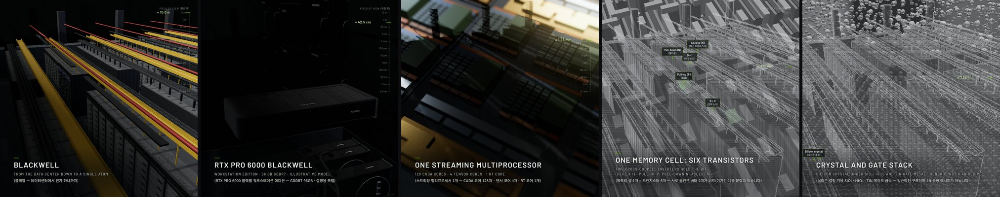

# Promptfilm

**한 문장으로 요청하면, 리서치를 거친 3D 모션그래픽이 나옵니다.** Promptfilm은 [Claude Code](https://claude.com/claude-code)용
스킬이에요. "그래픽카드 본체부터 실리콘 원자 하나까지 확대해 줘" 같은 요청을 받아, 실시간 3D 영상(Three.js)이 재생되는 HTML
파일 하나로 만들어 줍니다. 영상은 끊김 없이 반복 재생되고, 그대로 MP4로 뽑을 수 있어요.

[English README](README.md)



*`examples/blackwell-silicon-to-scale.v11.html`의 장면들이에요. 이 스킬의 기준이 된 두 영상 중 하나입니다.*


*엔진 테스트용 9:16 제품 영상이에요(가상의 스피커).*

## 할 수 있는 것

- **주제도 형식도 자유롭게**: 스케일 여행, 제품 광고, 게임·앱 데모, 작동 원리 설명, 유명한 장면 재현, 로고 스팅, 데이터
  스토리를 만들 수 있어요. 기본은 쇼츠·릴스·틱톡용 9:16이고, 16:9, 1:1, 4:5도 됩니다.
- **짐작 대신 리서치**: 리서치가 얼마나 걸릴지 먼저 가늠하고, 할지 말지 한 번만 물어요. 그다음 웹에서 사실·사진·영상을 직접
  찾아요. 화면에 나오는 숫자는 모두 출처가 있는 표에서 가져오고, 공개되지 않은 부분은 설명용으로 그렸다고 밝힙니다.
- **편집자 감각의 속도**: 자막이 가리키는 대상마다 카메라가 도착해서, 자막을 읽을 시간 동안 멈췄다가, 부드럽게 넘어가요.
  빌드하기 전에 시간 예산으로 계획부터 점검합니다.
- **자막은 한두 개 언어로**: 기본은 영어에 요청자의 언어를 더한 조합이에요(한국어로 요청하면 영어 + 괄호 안 한국어).
- **확인을 거친 뒤에야 완성**: 헤드리스 Chrome에서 자동 검사를 돌려요. 로딩, 오류, 속도, 가독성, 빈 화면, 모델의 구멍,
  깜빡임, 루프 이음매 등을 봅니다. 영상을 만들지 않은 새 서브에이전트가 화면을 따로 검수하고, 마지막으로 납품 게이트가
  판정해요. 게이트가 READY라고 하기 전에는 완성이라고 보고하지도, 최종 영상을 뽑지도 않아요.
- **로컬 Studio**: 타임라인에서 재생하고 넘겨 보고, 구간별 속도를 바꿀 수 있어요. 화면에 코멘트를 찍으면 Claude가 읽고
  고친 뒤 답을 달아요. 빌드 전에 스토리보드를 검토하고, 프레임 단위로 정확한 MP4(짧은 변 1080px, 60fps)도 여기서 내보내요.

## 영상이 만들어지는 과정

1. **첫 질문**: 리서치 깊이(오래 걸릴 때만), 화면 비율, 한 바퀴 길이, 자막 언어를 한 번에 물어요. 그다음부터는 알아서 진행해요.
2. **리서치**: 출처가 있는 사실, 참고 사진, 참고 영상 프레임을 모아요.
3. **계획과 스토리보드**: 장면, 카메라 움직임, 시간 예산을 짜요. 스토리보드는 Studio에서 열려 승인을 기다려요.
4. **빌드**: 함께 들어 있는 엔진 위에 영상을 작성해요(스튜디오 조명, 재질, 자막, 라벨, 끊기지 않는 카메라).
5. **검사, 검수, 게이트**: READY가 될 때까지 고치고 다시 빌드하고 다시 확인해요.
6. **납품**: `<film>/<name>.html`과 버전별 사본을 남기고, 원하면 MP4도 만들어요.

**영상 하나에 몇 분이 아니라 몇 시간**이 걸린다고 생각해 주세요. 리서치, 빌드, 여러 차례의 검사를 거치고 토큰도 많이 씁니다.

## 필요한 것

- **Claude Code**. 권장 환경은 Claude Opus 5.5, Sonnet 5.5, Fable 5.1(또는 그보다 새 버전)에 effort medium 이상이에요. 이 스킬을
  만들고 검증한 환경입니다. 다른 환경에서도 돌아가지만, 품질을 보장할 수 없다고 처음에 한 번 알려 줘요.
- **Node.js 20 이상**, PATH에 있는 **ffmpeg**, **Google Chrome 또는 Chromium**(없으면 `npx playwright install chromium`),
  **Python 3**(로컬 정적 서버용). 참고 영상에서 프레임을 뽑으려면 **yt-dlp**도 있으면 좋아요(선택).
- GPU가 있으면 좋아요. 검사와 렌더링이 헤드리스 Chrome의 WebGL로 돌아가거든요. GPU가 없으면 Chrome의 소프트웨어 렌더러로
  돌아가는데, 느려요.

macOS(Apple Silicon)에서 개발하고 검증했어요. Linux에서도 돌아갈 거예요. Windows는 확인하지 않았으니 WSL을 권해요.

## 설치

**플러그인으로 설치**(권장, 스크립트가 쓰는 패키지를 Claude Code가 함께 깔아 줘요). Claude Code에서:

```
/plugin marketplace add Seokwoooo/promptfilm
/plugin install promptfilm@promptfilm
```

셸에서 해도 돼요: `claude plugin marketplace add Seokwoooo/promptfilm && claude plugin install promptfilm@promptfilm`. 그다음
Claude Code를 다시 시작하거나 `/reload-plugins`를 실행하세요. 스킬 이름은 `/promptfilm:promptfilm`이에요. 그냥 모션그래픽을
만들어 달라고 해도 알아서 시작해요.

**직접 복사해서 설치**(개인 스킬 `/promptfilm`이 돼요):

```sh
git clone https://github.com/Seokwoooo/promptfilm.git
cp -R promptfilm/skills/promptfilm ~/.claude/skills/
cd ~/.claude/skills/promptfilm/scripts && npm install
```

**새 컴퓨터에서는 도구가 제대로 갖춰졌는지 한 번 확인하세요.** Claude Code에 "promptfilm 셀프테스트 돌려줘"라고 하면 돼요
(`node <skill>/scripts/selftest.mjs`, 약 10분). 임시 폴더에 엔진 테스트 영상을 만들고 모든 검사를 돌려요. 일부러 심어 둔
결함을 검사가 잡아내는지도 함께 확인합니다.

## 사용법

평소 쓰는 말로, 어떤 언어로든 요청하면 돼요:

```
우주 스케일 영상, 지구부터 관측 가능한 우주까지 확대하는 영상 html 만들어줘
제트엔진이 어떻게 작동하는지 16:9 가로 30초로, 한국어 자막만 넣어서 만들어줘
Make a motion graphic that zooms from a grain of sand out to the whole Sahara
```

이어서 "스튜디오 열어줘", "리뷰 반영해줘", "mp4로 뽑아줘"처럼 요청해도 돼요.

영상은 작업 폴더(`./<영상 이름>/`)에 만들어져요. 첫 질문에 한 답은 `./.promptfilm/settings.json`에 저장되고, 다음번에 먼저
추천돼요.

## 내 취향으로 바꾸기: 취향 프로필

`skills/promptfilm/taste.md`는 기본 취향이에요. 이 스킬을 함께 만든 사람의 취향이 담겨 있어요. 일반 시청자용 쇼츠를 만드는
크리에이터로, 이런 것들을 원해요.

- 아무것도 갑자기 튀어나오지 않기
- 실제처럼 보이는 대상
- 모든 단계를 가까이에서 보여 주기
- 부드러운 카메라
- 지루한 구간 없애기

이 파일을 `./.promptfilm/taste.md`(프로젝트 하나에만 적용)나 `~/.promptfilm/taste.md`(모든 프로젝트에 적용)로 복사해서
고치면 돼요. 형식 기본값, 구간 속도, 룩, 보고 라벨, 절대 하면 안 되는 것을 바꿀 수 있어요.

## 구성

```
.claude-plugin/          플러그인·마켓플레이스 매니페스트
skills/promptfilm/
  SKILL.md               작업 순서
  taste.md               기본 취향 프로필
  references/            원칙, 속도, 레이아웃, 엔진 API, 기법, 검사, 화면 검수, Studio …
  engine/                영상 엔진 (코어, 새 영상 템플릿, 테스트 영상 두 개)
  scripts/               새 영상, 빌드, 검사, 시간 예산, 렌더, 검수 자료, 게이트, 셀프테스트 …
  studio/                로컬 Studio (서버와 페이지)
  examples/              기준 영상 두 편의 코드 (템플릿이 아니라 구현 패턴)
  evals/                 테스트 요청과 기대 동작
```

## 라이선스

MIT예요. [LICENSE](LICENSE)를 보세요. 외부 구성 요소, 이미지 출처, 상표는 [THIRD_PARTY_NOTICES.md](THIRD_PARTY_NOTICES.md)에
정리해 두었어요.

Promptfilm은 개인 프로젝트이고, Anthropic과 제휴하거나 Anthropic의 보증을 받은 프로젝트가 아니에요.
