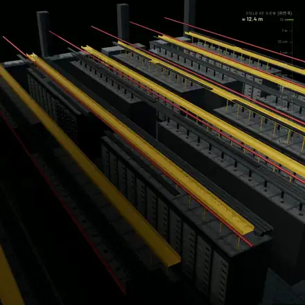
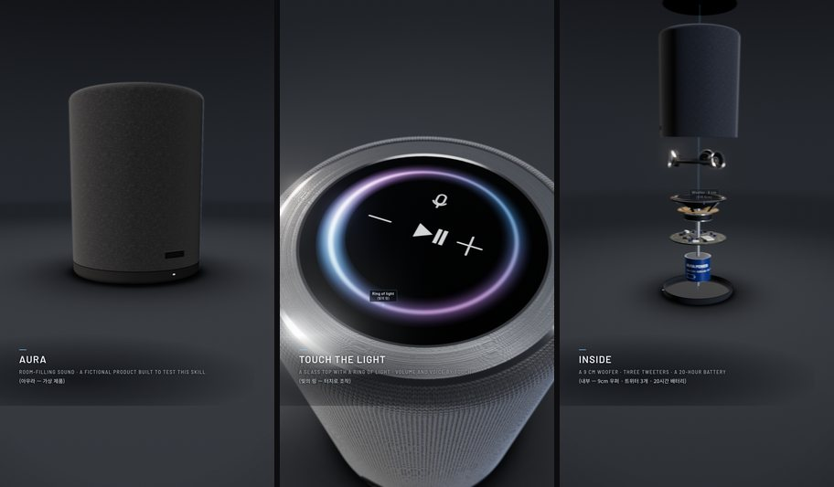
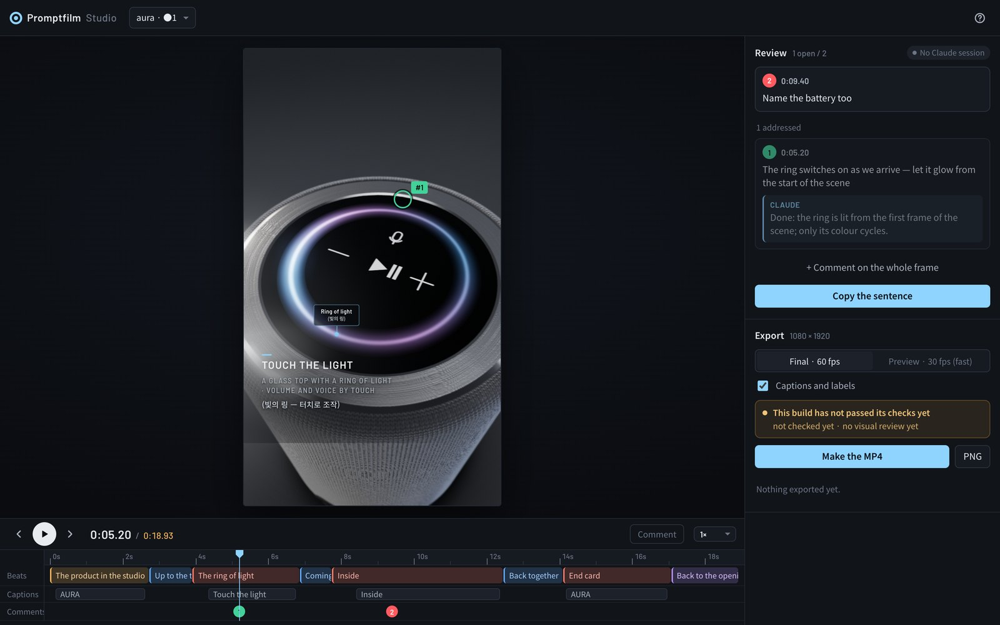

<div align="center">

# Promptfilm

**One sentence in. A researched 3D motion graphic out.**

A [Claude Code](https://claude.com/claude-code) skill that turns a request into a real-time 3D film —<br>
one self-contained HTML file that loops seamlessly and exports as a frame-exact MP4.

[](LICENSE)
[](#install)
[](#requirements)

English · [한국어](README.ko.md)



<sub><i>"Zoom from a Blackwell graphics card down to single atoms" — one of the two reference films, sped up</i></sub>

</div>

## Quick start

In Claude Code:

```
/plugin marketplace add Seokwoooo/promptfilm
/plugin install promptfilm@promptfilm
```

Restart Claude Code (or run `/reload-plugins`), then just ask:

```
Make a motion graphic that zooms from a grain of sand out to the whole Sahara
```

You also need Node.js 20+, ffmpeg and Chrome — see [Requirements](#requirements).

## What you get

- **A real film, not a slideshow** — real-time Three.js in one HTML file: studio light, physically based materials, one continuous
  camera, a seamless loop.
- **Researched, not guessed** — facts, photos and footage from the web. Every number on screen has a source; anything that isn't
  public is drawn as illustrative and labelled so.
- **Paced to be watched** — everything a caption names gets a stop: the camera arrives, holds while you read, then moves on gently.
- **Any subject, any format** — journeys through scale, product ads, app and game demos, explainers, recreations of famous scenes,
  logo stings, data stories. 9:16 for Shorts, Reels and TikTok, or 16:9, 1:1, 4:5. Captions in one or two languages.
- **Checked before it's called done** — automated QA, a visual review by a fresh subagent, and a delivery gate.
- **A Studio to review it** — scrub the film, comment on the frame, change the pace, export the MP4.

<div align="center">

<br><sub><i>A 9:16 product film from the engine's test set (a fictional speaker)</i></sub>
</div>

## How it works

| | Step | What happens |
|---|---|---|
| 1 | **Ask** | One kickoff question: research depth, aspect, loop length, caption languages. Then it works on its own. |
| 2 | **Research** | Sourced facts, reference photos, frames from reference videos. |
| 3 | **Storyboard** | Scene cards with a time budget, opened in the Studio for your approval. |
| 4 | **Build** | The film is written on the bundled engine. |
| 5 | **Check** | QA, a fresh-eyes review and the gate — fix and repeat until the gate says READY. |
| 6 | **Deliver** | The HTML (every version kept) and, when you want it, a 1080p 60 fps MP4. |

> [!NOTE]
> A film takes **hours** of agent work and a lot of tokens: research, building and several rounds of checks.

## The Studio



A local page that opens by itself while a film is being made:

- **Play and scrub** on a timeline of beats, captions and comments.
- **Comment on the frame** — click where something is wrong; Claude gets your note with a snapshot, fixes it and replies.
- **Change the pace** of any section; your edits are kept when the film is rebuilt.
- **Approve the storyboard** before anything is built.
- **Export** a frame-exact MP4 or a PNG still. A build that hasn't passed its checks is marked as such.

Everything stays on your machine: the Studio listens on `127.0.0.1` only.

## Requirements

| Tool | Used for |
|---|---|
| **Claude Code** | Recommended: Claude Opus 5.5, Sonnet 5.5 or Fable 5.1 (or newer), effort medium or above. Elsewhere it still runs and says once that quality can't be guaranteed. |
| **Node.js 20+** | the scripts |
| **ffmpeg** | video encoding |
| **Chrome or Chromium** | QA and rendering — or `npx playwright install chromium` |
| **Python 3** | a local static server |
| **yt-dlp** *(optional)* | frames from reference videos |

A GPU helps; without one, Chrome's software renderer is used, slowly. Developed and tested on macOS (Apple Silicon). Linux should
work; Windows is untested (WSL is the safer route).

## Install

### As a plugin (recommended)

```
/plugin marketplace add Seokwoooo/promptfilm
/plugin install promptfilm@promptfilm
```

Claude Code installs the scripts' packages for you. The skill is `/promptfilm:promptfilm`, and it also starts by itself when you ask for
a motion graphic. To update later, from a shell:

```sh
claude plugin marketplace update promptfilm && claude plugin update promptfilm@promptfilm
```

### As a personal skill

```sh
git clone https://github.com/Seokwoooo/promptfilm.git
cp -R promptfilm/skills/promptfilm ~/.claude/skills/
cd ~/.claude/skills/promptfilm/scripts && npm install
```

The skill is then `/promptfilm`.

### Check your setup

Ask Claude Code to **"run the promptfilm selftest"**. It takes about 10 minutes: it builds the engine's test films in a temporary folder
and runs every check, including checks that must catch planted faults.

## Usage

Ask in your own words, in any language:

```
A 30-second 16:9 explainer of how a jet engine works, captions in English only
An ad-style product film for our app, 9:16
우주 스케일 영상, 지구부터 관측 가능한 우주까지 확대하는 영상 html 만들어줘
```

Follow-ups work too: *"open the Studio"*, *"apply my review comments"*, *"render the MP4"*.

Films are made in your working folder, one folder each (`./<film-name>/`). Your answers to the kickoff question are remembered in
`./.promptfilm/settings.json` and offered first next time.

## Make it yours

The default taste lives in [`skills/promptfilm/taste.md`](skills/promptfilm/taste.md): a creator making Shorts for a general audience —
nothing pops in, subjects look real, every step is shown up close, the camera moves gently, nothing drags. Copy it to
`./.promptfilm/taste.md` (one project) or `~/.promptfilm/taste.md` (all projects) and change the format defaults, the pace, the look,
the report labels, or the list of things that must never happen.

## Troubleshooting

| Message | Fix |
|---|---|
| `Chrome not found` | `npx playwright install chromium`, or set `CHROME=/path/to/chrome` |
| `Cannot find package 'playwright-core'` | a hand-copied skill: run `npm install` in its `scripts/` folder |
| `ffmpeg: command not found` | install ffmpeg (`brew install ffmpeg`, `sudo apt install ffmpeg` …) |
| QA or rendering is very slow | no GPU: Chrome falls back to software rendering — it works, just slower |
| ⚠️ *Not the recommended setup* | shown once when the host, model or effort differs; the skill carries on |

## Repository layout

```
.claude-plugin/          plugin and marketplace manifests
skills/promptfilm/
├── SKILL.md             the workflow
├── taste.md             the default taste profile
├── references/          principles, pacing, layout, engine API, techniques, QA, review, Studio
├── engine/              the film engine: core, a new-film template, two test films
├── scripts/             new film, build, QA, time budget, render, review, gate, selftest
├── studio/              the local Studio
├── examples/            code from the two reference films (patterns, not templates)
└── evals/               test prompts with the expected behaviour
```

## License

[MIT](LICENSE). Third-party components, imagery credits and trademarks: [THIRD_PARTY_NOTICES.md](THIRD_PARTY_NOTICES.md).
Promptfilm is an independent project, not affiliated with or endorsed by Anthropic.
